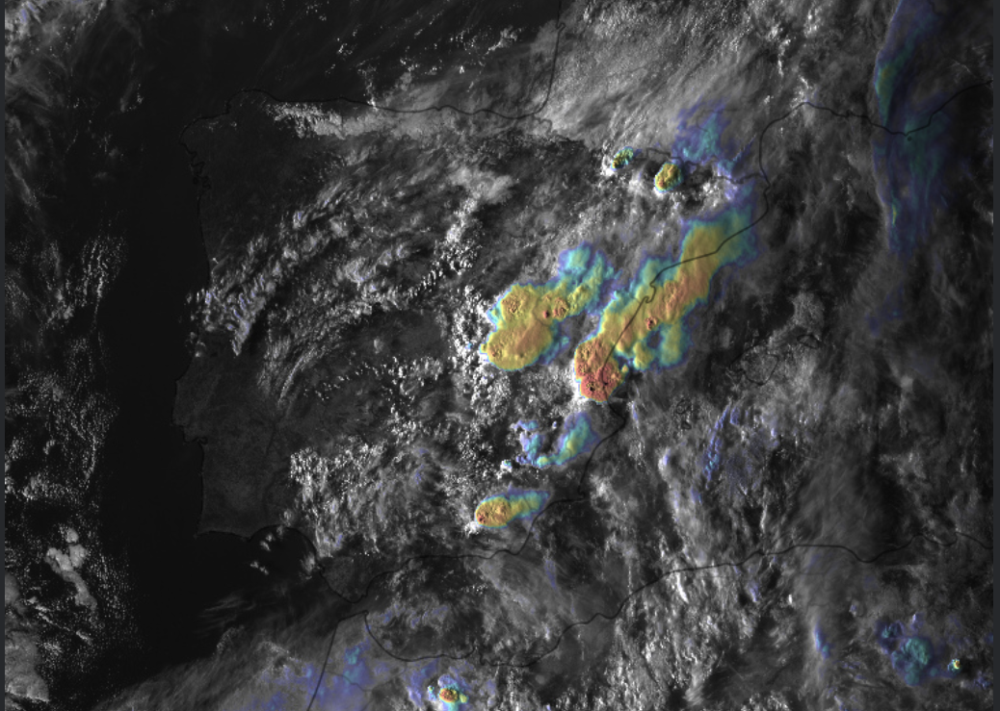
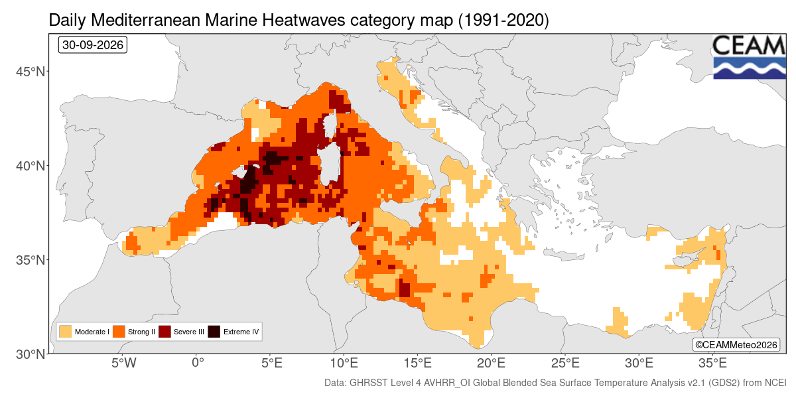

<!-- Generado por `npm run publicar` desde articulos/. Edita el original, no este archivo. -->
Lo que está ocurriendo estos días en la vertiente mediterránea se sale de lo habitual. En pocas semanas se han sucedido varios episodios de tormentas de alto impacto, y el más reciente, entre el 1 y el 2 de octubre, llevó a AEMET a [activar el aviso rojo](https://www.eldiario.es/comunitat-valenciana/aemet-mantiene-alerta-roja-litoral-castellon-lluvias-250-litros-metro-cuadrado_1_13555707.html) en el litoral de Castellón, Valencia y Tarragona. Se registraron unos 145 l/m² en Alcalà de Xivert y más de 125 l/m² en Cabanes, Peñíscola o Polinyà del Xúquer, con inundaciones repentinas y clases suspendidas para más de 300.000 alumnos.

Lo peculiar no es tanto la lluvia como la configuración atmosférica que la ha producido. Normalmente asociamos este tipo de episodios a una DANA o a una vaguada profunda, que aportan aire frío en altura y un fuerte forzamiento dinámico. Esta vez, como en otros episodios de septiembre, el forzamiento ha sido bastante más modesto: un frente atlántico y una vaguada poco profunda, junto con vientos de componente marítima. Y aun así, las tormentas han sido muy eficientes descargando agua.

## Un mar fuera de escala

Mi hipótesis es que el factor diferencial está en el propio Mediterráneo. Este verano ha batido todos los registros: [según AEMET](https://www.infobae.com/espana/2026/09/06/las-aguas-del-mediterraneo-baten-su-record-historico-de-temperatura-con-maximas-que-superan-los-28-grados/), la temperatura superficial media del conjunto del mar alcanzó 28,54 °C el 13 de agosto, el valor más alto desde al menos 1940, y en Baleares se llegaron a medir más de 33 °C. A mediados de septiembre la media seguía en 27,2 °C, más de 2 °C por encima de lo normal, con anomalías de hasta +5 °C en el Mediterráneo central.

## Por qué importa tanto la temperatura del mar

Un mar más cálido evapora más agua y calienta desde abajo el aire de los niveles bajos. Además, por la relación de Clausius-Clapeyron, cada grado adicional permite que el aire contenga en torno a un 7 % más de vapor de agua. Es decir, el aire que llega a la costa desde el mar lo hace más cálido y húmedo, con más energía disponible para la convección (CAPE) y con una base de nube más baja.

En esas condiciones no hace falta un disparador muy potente. Basta una línea de convergencia en superficie, el relieve próximo a la costa o las corrientes de salida de tormentas anteriores para iniciar y mantener la convección. Y si el flujo del mar persiste, las tormentas se regeneran sobre la misma zona, lo que explica acumulados tan elevados en pocas horas.

En cierto modo, es un comportamiento más propio de una región tropical que de nuestras latitudes. En los trópicos es habitual que la convección se organice con un forzamiento dinámico débil, alimentada sobre todo por un ambiente muy cálido y húmedo. Además, con un aire tan cálido la isoterma de 0 °C está muy alta, buena parte de la nube se encuentra a temperaturas positivas y la lluvia se forma de manera muy eficiente por colisión y coalescencia de gotas, sin necesidad de pasar por la fase de hielo. El resultado son tormentas con una enorme capacidad para descargar agua en poco tiempo.

No es una idea nueva. Existe literatura científica sobre la influencia de la temperatura del mar en las lluvias torrenciales del Mediterráneo y sobre el papel de las olas de calor marinas en episodios recientes de tormentas intensas.

## Lo que queda por confirmar

Conviene, eso sí, ser prudentes. Un mar muy cálido no genera tormentas por sí solo: hace falta que la atmósfera se desestabilice y que exista algún mecanismo de disparo. Y para cuantificar qué parte del impacto se debe a la temperatura del mar habrá que hacer experimentos de sensibilidad con modelos, comparando estos episodios con un mar en condiciones climatológicas.

Lo que sí parece claro es que, con un Mediterráneo así, el umbral para que una situación aparentemente discreta acabe en un episodio de alto impacto es más bajo. Y queda todo el otoño por delante, la época en la que suelen llegar las DANAs de mayor entidad. Recomiendo seguir con atención los avisos de AEMET.
